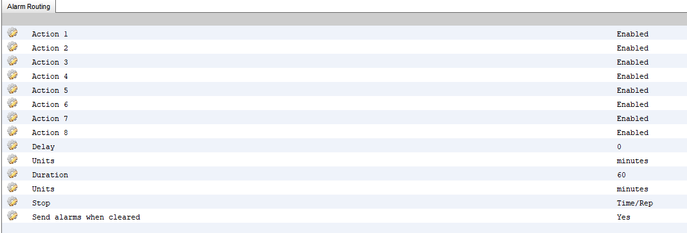

# AlarmMonitor
The program allows for monitoring Danfoss refrigeration controllers via email and logging alarms in a database.
It is currently a work in progress.  I will be adding alerting via email and text message through Voip.ms

Has been tested with the following:
* AK2-SC255
* AK-SM880
* AK-SM880A

## Installation

1. Create a MySQL database using [AlarmMonitor.sql](sql/AlarmMonitor.sql)
2. Copy [AlarmMonitorSample.ini](AlarmMonitor/AlarmMonitorSample.ini) to your build directory and rename to **AlarmMonitor.ini**.
3. Set the Database information to match your environment.
4. Set the email server/account information.  *This should be a dedicated email box for alarms for this program.*  **All messages will be deleted from the box after the program processes them.**
5. Create Store Mappings. (See below example.  Key=*Store Name Configured In Controller which appears in the email subject*)
```
[Stores]
TEST001=TestStore1
TEST002=TestStore2
TEST003=TestStore3
```
6. Setup Danfoss controllers to email alarms to the mailbox defined in the ini file.  **(It is recommended that you set up a unique network connection in the controller to avoid any conflicts with other alarm monitoring.)**  Actions can be modified to your needs.  The important part is the *Stop* & *Send alarms when cleared* settings.

	Here is an example for an AK-SM880.  The configuration for the other tested controllers is similar:
	
	
7. Run *AlarmMonitor.exe* to begin monitoring for alarms.

